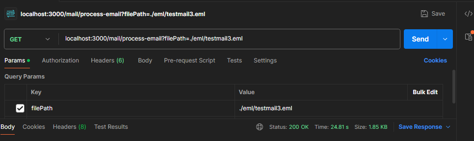
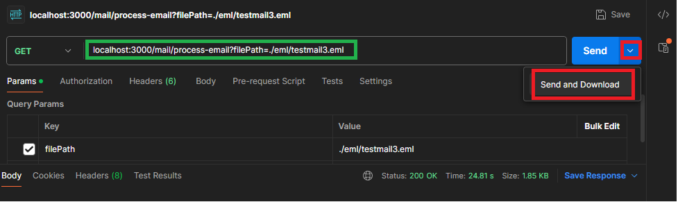
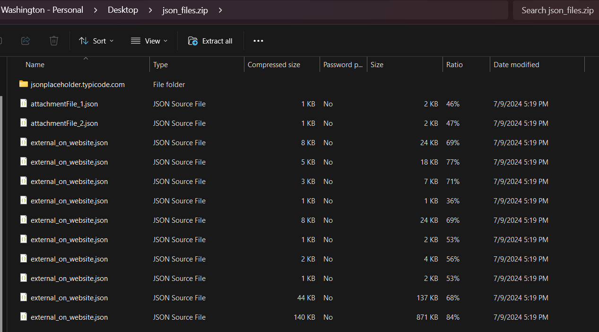

## Description

Emailprow is an email processor.
Emailprow can extract multiple files in json format from an email file.

### Prerequisites

- Node.js
- npm

### Installation

1- If you have not cloned the repository, clone the repository.

2- Position yourself within the root of the project (where the package.json file is).

3- Run 'npm install':

```bash
$ npm install
```

### Running the app

```bash
$ npm run start
```

### Manual

- By default there is a folder created (./eml) at the root of the project where there are already .eml files.

```bash
./eml/testmail.eml
./eml/testmail2.eml
./eml/testmail3.eml
./eml/links2.eml
```

- You can set your own files to the existing location or create a folder within the project file system.

- To process the .eml file, you must pass its path as a parameter to an http get request as follows:
- You can use an http client like Postman:



- To execute the request select:



- After the request finishes processing the request, you select a location where you want to save the .zip files.



### Tests

```bash
# unit tests
# test coverage
$ npm run test:cov

$ npm run test

# e2e tests
$ npm run test:e2e
```

## Stay in touch

- Author - Washington Trucido
- Linkedin - [www.linkedin.com/in/washington-javier-trucido-ba3229169](www.linkedin.com/in/washington-javier-trucido-ba3229169)

## License

Emailprow is [MIT licensed](LICENSE).
